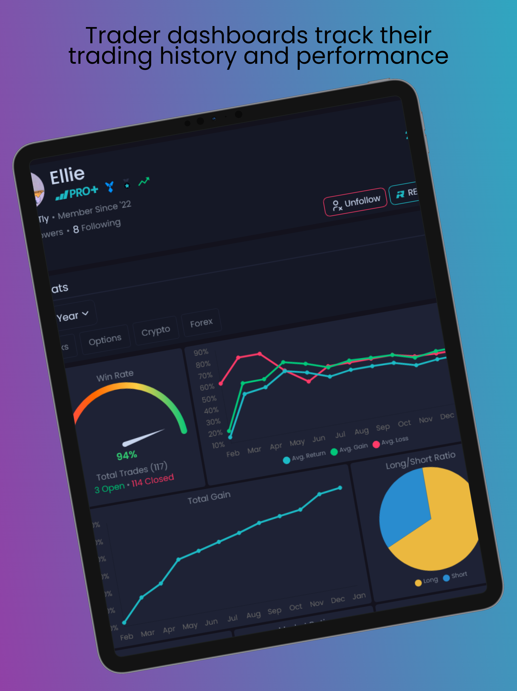

# [NVSTly](https://nvstly.com): Social Investing

    

A social investing platform where retail traders collaborate, share and exchange knowledge, analysis, and ideas. Supporting all stocks, futures, forex, & cryptocurrency markets. Track trades with extensive insights & in-depth performance stats, share them in real-time with your followers or to Discord & social media, follow traders & receive real-time notifications of their positions to copy trade, with cross-brokerage support to automate it all and provide easy 1-click copy trading functionality.

    

## Links:
[NVSTly Web](https://nvstly.com) | [iOS App](https://nvstly.com/go/ios) | [Google Play App](https://nvstly.com/go/android) | [Discord App/Bot](https://nvstly.com/go/bot) | [Discord Server](https://nvstly.com/go/discord)

  
  &nbsp;
  

## Awards
[People's Choice Award](https://nvstly.com/shrt/bnzgaward) from Benzinga FinTech Awards 2024  
#1 FinTech Product of the Week (x2)  & #4 FinTech Product of the Month on [Product Hunt](https://www.producthunt.com/products/nvstly-social-investing)

  

## Feature Highlights

    

    

    

    

    

    

    

    

    

    

    

    

## Socials

[Discord](https://nvstly.com/discord) | [X/Twitter](https://nvstly.com/go/x) | [YouTube](https://nvstly.com/go/youtube) | [TikTok](https://nvstly.com/go/tiktok) | [Instagram](https://nvstly.com/go/instagram) | [Threads](https://nvstly.com/go/threads) | [Facebook](https://nvstly.com/go/facebook) | [LinkedIn](https://nvstly.com/go/linkedin) | [Linktree](https://nvstly.com/go/linktree) | [Mastodon](https://nvstly.com/go/mastodon) | [Nostr](https://nvstly.com/go/nostr) | [Bluesky](https://nvstly.com/go/bsky) | [Hive/InLeo](https://nvstly.com/hive) | [Product Hunt](https://nvstly.com/go/producthunt)

## About Us

The founder of [NVSTly](https://nvstly.com) envisioned a multi-platform community for traders of all levels. As 2020 approached, the economy stalled, leading to a surge in [retail investors](https://www.investopedia.com/terms/r/retailinvestor.asp) seeking income amidst job losses and business shutdowns. This period coincided with a market dip, making stocks more affordable and accessible for small investors. With the spotlight on the [/r/wallstreetbets subreddit,](https://theprint.in/theprint-essential/the-gamestop-story-how-a-group-of-investors-on-reddit-gave-wall-street-a-wild-week/595181/), many new traders experienced significant losses, often investing blindly due to FOMO ("Fear of Missing Out") and a lack of experience or due diligence.

NVSTly emerged to guide these new traders, offering direction in stock market investing and day trading. The platform provides quality trade alerts from experienced analysts, detailing stock or options plays, entry prices, trim updates, and close alerts. New traders quickly enhance their knowledge and experience by following these alerts. As interest in crypto and NFTs grew, Trade Hub expanded into cryptocurrency trading, offering the same educational support and how-tos for navigating this new market.

Our team dedicated extensive hours to developing a platform designed by traders for traders, allowing users to input their trades and share personal callouts. The system tracks positions, calculates statistics, scores traders based on performance, and ranks them on a leaderboard. Traders can follow others, receive notifications of new trades, and copy them. A reputation system allows users to give positive karma points to those whose trades benefit them or to show respect for top or emerging traders. Displaying trade stats, followers, and reputation helps top traders stand out, guiding others on who to follow.

NVSTly offers multiple ways for users to earn. Integrated features allow for crypto tipping between traders. Monthly, top-ranked traders can access prize pools, including merchandise, sponsored prizes, or cash winnings. As new features are developed, users will have additional opportunities to contribute and earn rewards.

## [Help & FAQs](https://help.nvstly.com)
See our [Help Center](https://help.nvstly.com) for support articles and frequently asked questions

## [Contact](https://nvstly.com/contact)
To contact our team, you can send an email to team@nvst.ly or reach us directly in our [Discord server](https://nvstly.com/discord)

### Terms & Policies

[Terms & Conditions](https://nvstly.com/terms)   
[Privacy Policy](https://nvstly.com/privacy)

#
© 2021-2025, [Trade Hub, LLC](https://tradehub.llc) or its affiliates
